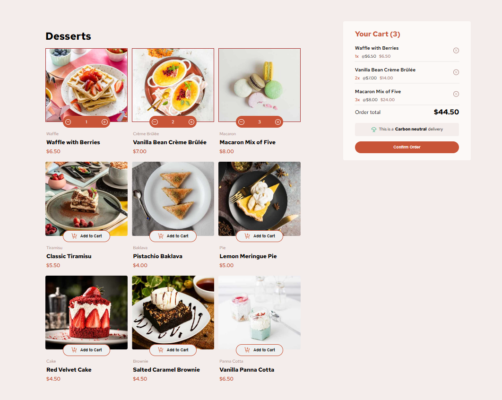

# Frontend Mentor - Product list with cart solution

This is a solution to the [Product list with cart challenge on Frontend Mentor](https://www.frontendmentor.io/challenges/product-list-with-cart-5MmqLVAp_d). Frontend Mentor challenges help you improve your coding skills by building realistic projects.

## Table of contents

- [Overview](#overview)
  - [The challenge](#the-challenge)
  - [Screenshot](#screenshot)
  - [Links](#links)
- [My process](#my-process)
  - [Built with](#built-with)
  - [What I learned](#what-i-learned)
  - [Continued development](#continued-development)
  - [Useful resources](#useful-resources)
- [Author](#author)
- [Acknowledgments](#acknowledgments)

**Note: Delete this note and update the table of contents based on what sections you keep.**

## Overview

### The challenge

Users should be able to:

- Add items to the cart and remove them
- Increase/decrease the number of items in the cart
- See an order confirmation modal when they click "Confirm Order"
- Reset their selections when they click "Start New Order"
- View the optimal layout for the interface depending on their device's screen size
- See hover and focus states for all interactive elements on the page

### Screenshot



### Links

- Solution URL: https://github.com/Ashish777Dev/Product-List
- Live Site URL: https://ecommerce-product-list.netlify.app

## My process

### Built with

- Semantic HTML5 markup
- CSS custom properties
- Flexbox
- CSS Grid
- Mobile-first workflow
- [React](https://reactjs.org/) - JS library

### What I learned

1.Handle Context Api in React Js
<br>
2.Learned a Css Grid trick

```css
.product-section {
  display: grid;
  grid-template-columns: repeat(auto-fit, minmax(250px, 1fr));
  gap: 15px;
  width: 100%;

  place-content: center;
}
```

```js
import React, { createContext, useState } from "react";
import data from "../data.json";
const ProductContext = createContext();

function ProductContextProvider({ children }) {
  const [products, setProducts] = useState(data);
  const [cart, setCart] = useState([]);
  const [modal, setModal] = useState(false);
  const addToCart = (newItem) => {
    setCart((prevCart) => [...prevCart, { ...newItem, quantity: 1 }]);
  };
  const findItemInCart = (name) => {
    return cart.find((item) => item.name === name);
  };
  const isAddedToCart = (name) => {
    return findItemInCart(name) !== undefined;
  };

  const productQuantity = (name) => {
    const item = findItemInCart(name);
    return item ? item.quantity : 1;
  };

  const increment = (name) => {
    setCart((prevCart) =>
      prevCart.map((item) =>
        item.name === name
          ? { ...item, quantity: (item.quantity || 0) + 1 }
          : item
      )
    );
  };

  const decrement = (name) => {
    setCart((prevCart) =>
      prevCart
        .map((item) =>
          item.name === name
            ? { ...item, quantity: (item.quantity || 0) - 1 }
            : item
        )
        .filter((item) => item.quantity > 0)
    );
  };
  const removeItem = (name) => {
    setCart((prevCart) => prevCart.filter((item) => item.name !== name));
  };
  const orderTotal = () => {
    if (!cart) return;
    return cart.reduce((acc, item) => (acc += item.price * item.quantity), 0);
  };

  const handleModal = () => {
    setModal(!modal);
  };

  const resetAll = () => {
    setModal(false);
    setCart([]);
  };
  return (
    <ProductContext.Provider
      value={{
        products,
        setProducts,
        cart,
        setCart,
        addToCart,
        isAddedToCart,
        productQuantity,
        increment,
        decrement,
        removeItem,
        orderTotal,
        handleModal,
        modal,
        setModal,
        resetAll,
      }}
    >
      {children}
    </ProductContext.Provider>
  );
}

export { ProductContext, ProductContextProvider };
```

## Author

- Website - https://ecommerce-product-list.netlify.app
- Frontend Mentor - <a href="https://github.com/Ashish777Dev/Product-List">@Ashish777Dev</a>
